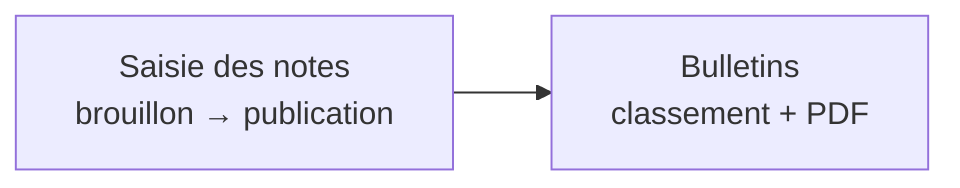

# Kotaschool — Frontend

Interface web de **Kotaschool** : gestion scolaire, saisie/publication des notes, classements et bulletins (EPSP – RDC).

- Application : `http://localhost:3000`
- API associée : `http://localhost:4000/api/v1` — voir [`../kotaschool-backend/README.md`](../kotaschool-backend/README.md)

---

## 🧰 Stack

- **Next.js 15** (App Router) + **React 19**
- **Tailwind CSS 3** — style (`tailwind.config.ts`, classes `brand-*`)
- **Zustand** — état client (session persistée)
- **Axios** — client HTTP (`lib/api/client.ts`)
- **@tanstack/react-query** — data fetching (fourni par `app/providers.tsx`)
- **class-variance-authority / tailwind-merge** — utilitaires UI

---

## 📁 Structure

```
app/
├── layout.tsx                # Layout racine (Providers)
├── providers.tsx             # QueryClientProvider
├── globals.css               # Tailwind + styles d'impression (@media print)
├── page.tsx                  # / → redirect /login
├── (auth)/
│   └── login/page.tsx        # Connexion
└── (dashboard)/
    ├── layout.tsx            # Shell (menu selon rôle + garde d'accès + redirect login)
    ├── dashboard/page.tsx    # Vue d'ensemble selon le rôle
    ├── students/page.tsx     # Élèves & inscriptions
    ├── teachers/page.tsx     # Enseignants
    ├── academic/page.tsx     # Structure & matières (coefficients)
    ├── assignments/page.tsx  # Affectations
    ├── grades/
    │   └── entry/page.tsx        # Saisie des notes (enseignant)
    └── reports/page.tsx      # Bulletins (classement + PDF)
components/
└── grades/grade-table.tsx    # Grille de saisie réutilisable (lecture seule possible)
lib/
└── api/client.ts             # Instance Axios + injection du JWT
stores/
└── auth.store.ts             # Session zustand persist (localStorage) + flag hydrated
```

---

## 👥 Rôles et routes

Le menu et l'accès sont filtrés par rôle dans `app/(dashboard)/layout.tsx` (un accès direct à une route non autorisée affiche *« Accès non autorisé pour votre rôle »*).

| Route | Page | `ADMIN` | `TEACHER` | `STUDENT` |
|---|---|---|---|---|
| `/dashboard` | Tableau de bord | ✅ | ✅ | ✅ |
| `/students` | Élèves & inscriptions | ✅ | ❌ | ❌ |
| `/teachers` | Enseignants | ✅ | ❌ | ❌ |
| `/academic` | Structure & matières | ✅ | ❌ | ❌ |
| `/assignments` | Affectations | ✅ | ❌ | ❌ |
| `/grades/entry` | Saisie des notes | ❌ | ✅ | ❌ |
| `/reports` | Bulletins | ✅ | ❌ | ❌ |
| `/grades/my-scores` | Mes notes en direct | ❌ | ❌ | ✅ |
| `/grades/my-notes` | Mes bulletins & palmarès | ❌ | ❌ | ✅ |
| `/login` | Connexion | publique | | |

---

## 🖥️ Pages et fonctionnalités

- **Login** — connexion via `POST /auth/login`, enregistre `{ accessToken, user }` dans le store.
- **Dashboard** — selon le rôle : statistiques cliquables et accès aux bulletins (admin), affectations + accès rapide à la saisie (enseignant), notes récentes et accès aux bulletins (élève).
- **Élèves & inscriptions** — créer un élève, inscrire un élève (classe + année), liste avec inscription active.
- **Enseignants** — créer un enseignant, liste des fiches.
- **Structure & matières** — années, sections, options, classes, matières et **coefficients classe–matière** ; arbre de la structure.
- **Affectations** — affecter un enseignant à un couple classe–matière pour une année, liste.
- **Saisie des notes** *(enseignant)* — choisir son affectation, créer/sélectionner une épreuve (semestre, période, type, date), saisir la grille, **enregistrer en brouillon**, **publier** ; les notes comptent immédiatement pour les bulletins et la grille passe en lecture seule.
- **Bulletins** *(admin)* — sélectionner un semestre, **recalculer le classement**, consulter le bulletin détaillé d'un élève et l'**imprimer / exporter en PDF**.

---

## 🔄 Workflows utilisateur



- **Enseignant** : `/grades/entry` → sélection de l'affectation → création d'une épreuve → saisie → *Enregistrer en brouillon* → *Publier les notes* (elles comptent immédiatement pour les bulletins).
- **Administrateur** : `/reports` → *Recalculer le classement* → ouvrir un bulletin → *Imprimer / PDF*.

---

## ⚙️ Configuration

Créez `.env.local` (copiez `.env.local.example` si présent) :

```
NEXT_PUBLIC_API_URL=http://localhost:4000/api/v1
```

> L'URL par défaut du client est `http://localhost:4000/api/v1` si la variable est absente.

---

## 🚀 Installation & démarrage

```bash
cd kotaschool-frontend
npm install
npm run dev          # http://localhost:3000
```

Scripts disponibles :

| Script | Description |
|---|---|
| `npm run dev` | Serveur de développement (hot reload) |
| `npm run build` | Build de production |
| `npm start` | Serveur de production (après build) |
| `npm run lint` | ESLint |

> Veillez à ce que l'API tourne sur `http://localhost:4000` (voir le README backend).

---

## 🔐 Session et persistance

- `stores/auth.store.ts` : la session est **persistée** dans `localStorage` (clé `kotaschool-auth`) via `persist` de Zustand.
- La réhydratation de `persist` étant asynchrone, le store expose un flag `hydrated` : le layout attend la fin de réhydratation avant de rediriger (évite la déconnexion au rechargement).
- Si aucun utilisateur valide : redirection vers `/login`.
- `lib/api/client.ts` injecte automatiquement `Authorization: Bearer <token>` sur chaque requête.

---

## 🔑 Comptes de démonstration

| Utilisateur | Rôle | Mot de passe |
|---|---|---|
| `admin` | Administrateur | `ChangeMe123!` |
| `prof` | Enseignant | `ChangeMe123!` |

---

## 🛠️ Dépannage

| Symptôme | Cause / solution |
|---|---|
| Page blanche / `ChunkLoadError` en dev | Cache webpack corrompu : arrêter le serveur, supprimer `.next`, relancer `npm run dev` |
| Erreurs réseau vers l'API | Vérifier `NEXT_PUBLIC_API_URL` et que l'API répond sur `http://localhost:4000/api/v1/health` |
| Redirection vers `/login` après un écran | Session absente : se connecter ; sinon vérifier `localStorage` (`kotaschool-auth`) |
| « Accès non autorisé pour votre rôle » | Le rôle connecté n'a pas accès à cette route (voir tableau des rôles) |